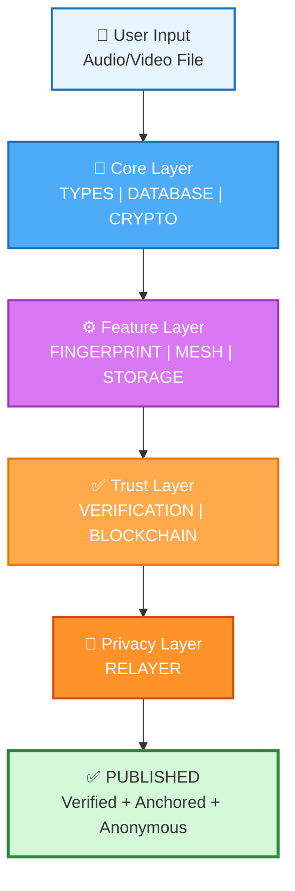
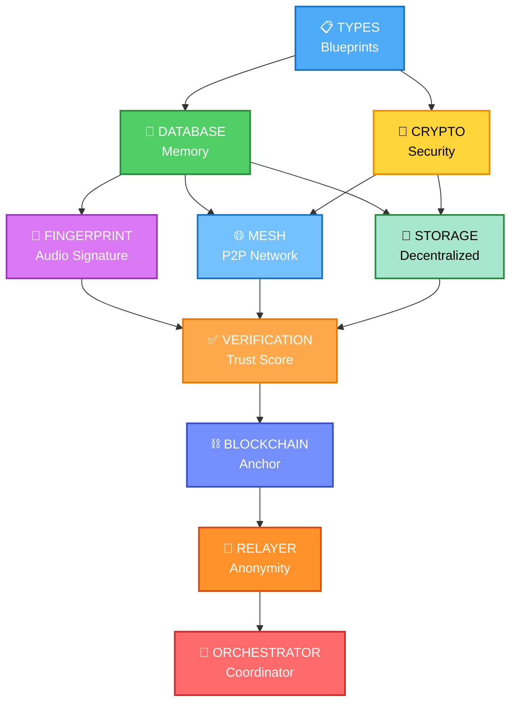
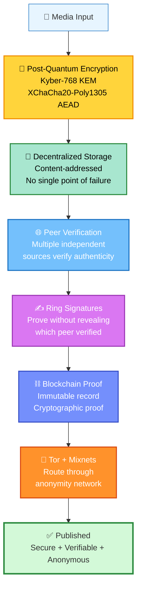
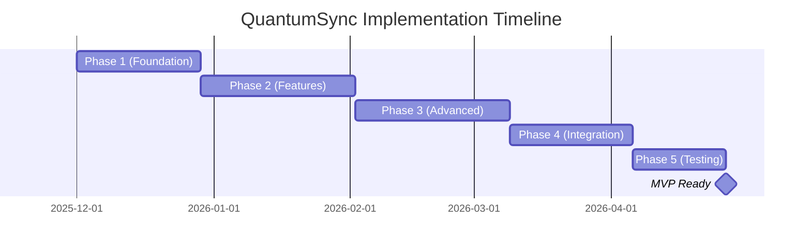

# 🏗️ QuantumSync Framework - One Page Concept

## What is QuantumSync?

A **privacy-preserving, decentralized media sharing framework** that combines post-quantum cryptography, distributed storage, peer-to-peer verification, and blockchain anchoring to enable secure, verifiable, and anonymous publication of media evidence.

---

## Problem Statement

> How can we create a system where media (audio/video evidence) can be published, verified by multiple peers, and permanently anchored to a blockchain—all while maintaining **absolute privacy** and **post-quantum security** for the publisher?

---

## Core Vision

```mermaid
graph LR
    A["🎬 Publisher<br/>Captures Evidence"] -->|1. Extract Fingerprint| B["🎵 Audio Signature<br/>Unique Proof"]
    B -->|2. Encrypt & Upload| C["💾 Decentralized Storage<br/>IPFS/Arweave"]
    C -->|3. Broadcast to Peers| D["🌐 Peer Network<br/>Local Mesh"]
    D -->|4. Verify & Report| E["✅ Confidence Score<br/>Multi-sig Agreement"]
    E -->|5. Anonymously Anchor| F["⛓️ Blockchain<br/>Immutable Record"]
    
    style A fill:#e7f5ff,stroke:#1971c2,stroke-width:2px
    style B fill:#da77f2,stroke:#9c36b5,stroke-width:2px,color:#fff
    style C fill:#a8e6cf,stroke:#2b8a3e,stroke-width:2px,color:#000
    style D fill:#74c0fc,stroke:#1971c2,stroke-width:2px,color:#fff
    style E fill:#ffa94d,stroke:#e67700,stroke-width:2px,color:#fff
    style F fill:#748ffc,stroke:#364fc7,stroke-width:2px,color:#fff
```



---

## Key Features

| Feature | Benefit |
|---------|---------|
| 🔐 **Post-Quantum Cryptography** | Resistant to quantum computing attacks (uses Kyber-768 + Dilithium3) |
| 📍 **Peer Verification** | Media verified by local mesh network peers for authenticity |
| 💾 **Decentralized Storage** | Media stored on IPFS/Arweave—no central server to shut down |
| ⛓️ **Blockchain Anchoring** | Immutable proof of existence on Polygon/Ethereum |
| 🔀 **Tor Integration** | Submissions routed through Tor + mixnets for anonymity |
| 🎵 **Audio Fingerprinting** | FFT-based extraction of unique "voice print" of recordings |
| 🤝 **Mesh Network** | Peers communicate directly via WebRTC/Wi-Fi Direct |
| 📊 **Confidence Scoring** | Aggregates peer signatures into trust metric (0-100%) |

---

## Architecture at a Glance



---

## 10-Step Publishing Workflow

| Step | Action | Module |
|------|--------|--------|
| 1️⃣ | Validate input file | TYPES |
| 2️⃣ | Extract audio fingerprint using FFT | FINGERPRINT |
| 3️⃣ | Encrypt metadata with post-quantum crypto | CRYPTO |
| 4️⃣ | Upload encrypted media to IPFS | STORAGE |
| 5️⃣ | Discover peers in local mesh network | MESH |
| 6️⃣ | Broadcast fingerprint to peers for verification | MESH |
| 7️⃣ | Collect peer reports with signatures | MESH |
| 8️⃣ | Verify signatures & aggregate confidence score | VERIFICATION |
| 9️⃣ | Create blockchain anchor transaction | BLOCKCHAIN |
| 🔟 | Submit anonymously via Tor relayers | RELAYER |

**Result**: Media is published, peer-verified, permanently anchored, and publisher remains anonymous.

---

## 10 Core Modules



| Module | Purpose | Tech Stack |
|--------|---------|-----------|
| **TYPES** | Data contracts & interfaces | TypeScript |
| **DATABASE** | Persistent storage layer | SQLite / PostgreSQL |
| **CRYPTO** | Encryption & signatures | Kyber-768, Dilithium3, XChaCha20 |
| **FINGERPRINT** | Extract audio signatures | FFT, bandpass filtering |
| **MESH** | P2P peer discovery & messaging | WebRTC, Bluetooth LE, mDNS |
| **STORAGE** | Upload to decentralized networks | IPFS, Arweave |
| **VERIFICATION** | Aggregate peer reports | Statistical aggregation, z-score |
| **BLOCKCHAIN** | Anchor to L2 blockchain | Polygon/Ethereum, ethers.js |
| **RELAYER** | Anonymous submission network | Tor SOCKS5, mixnets |
| **ORCHESTRATOR** | Coordinate all modules | Main workflow engine |

---

## Security Model



---

## Use Cases

| Use Case | Benefit |
|----------|---------|
| 🎬 **Citizen Journalism** | Publish evidence without government suppression |
| ⚖️ **Human Rights Documentation** | Verify atrocities with peer consensus |
| 🏥 **Medical Whistleblowing** | Confidential evidence with blockchain proof |
| 🌍 **Environmental Monitoring** | Decentralized proof of environmental violations |
| 📹 **Accountability Media** | Verifiable evidence that can't be deleted |

---

## Technical Specifications

```
┌─────────────────────────────────────────────┐
│ FRAMEWORK SPECIFICATIONS                    │
├─────────────────────────────────────────────┤
│ Language:        TypeScript / Node.js        │
│ Post-Quantum:    Kyber-768 (key), Dilithium3 (sig) │
│ Encryption:      XChaCha20-Poly1305 (AEAD)  │
│ Blockchain:      Polygon/Ethereum (L2)      │
│ Storage:         IPFS (public), Arweave (archive) │
│ Networking:      WebRTC, Bluetooth LE, mDNS │
│ Anonymity:       Tor SOCKS5 + mixnets       │
│ Audio Analysis:  FFT (Fast Fourier Transform) │
│ Database:        SQLite (dev), PostgreSQL (prod) │
│ Consensus:       Multi-signature aggregation │
└─────────────────────────────────────────────┘
```

---

## Implementation Roadmap



**Phase Breakdown**:
- **Phase 1** (4 weeks): Types → Database → Crypto
- **Phase 2** (5 weeks): Storage → Fingerprint → Mesh
- **Phase 3** (5 weeks): Blockchain → Relayer → Verification
- **Phase 4** (4 weeks): Orchestrator → Integration
- **Phase 5** (3 weeks): Testing → Documentation

---

## Why QuantumSync?

| Challenge | QuantumSync Solution |
|-----------|---------------------|
| **Censorship** | Decentralized storage + blockchain = unstoppable |
| **Quantum threats** | Post-quantum crypto immune to quantum attacks |
| **Publisher doxxing** | Tor + Tor relayers + mixnets = anonymous submission |
| **Media tampering** | Peer verification + signatures = tamper detection |
| **Server shutdown** | No central server—lives on peer devices + blockchain |
| **Verification trust** | Multiple independent peers verify + ring signatures hide source |

---

## Success Metrics

✅ **Technical**:
- Post-quantum crypto validated against NIST standards
- Peer verification consensus >= 3 signatures
- Blockchain proof of existence on mainnet
- Tor anonymity preserved (no IP leaks)

✅ **Functional**:
- Full 10-step workflow completes in < 5 minutes
- Media retrievable from IPFS indefinitely
- Confidence score reflects peer agreement
- Zero publisher metadata leaked

✅ **Security**:
- Withstands quantum computing attacks
- Ring signatures prevent identity disclosure
- Encrypted storage unreadable without key
- Tor integration prevents IP tracking

---

## Next Steps

1. **Read** `BUILDING.md` for implementation roadmap
2. **Study** individual module READMEs for technical details
3. **Review** `ARCHITECTURE_DIAGRAM.md` for system design
4. **Start** with Phase 1: Types → Database → Crypto
5. **Build** incrementally, testing at each stage

---

**QuantumSync**: _Privacy. Verification. Permanence. Anonymity._

🚀 Build the framework that protects evidence and empowers truth.