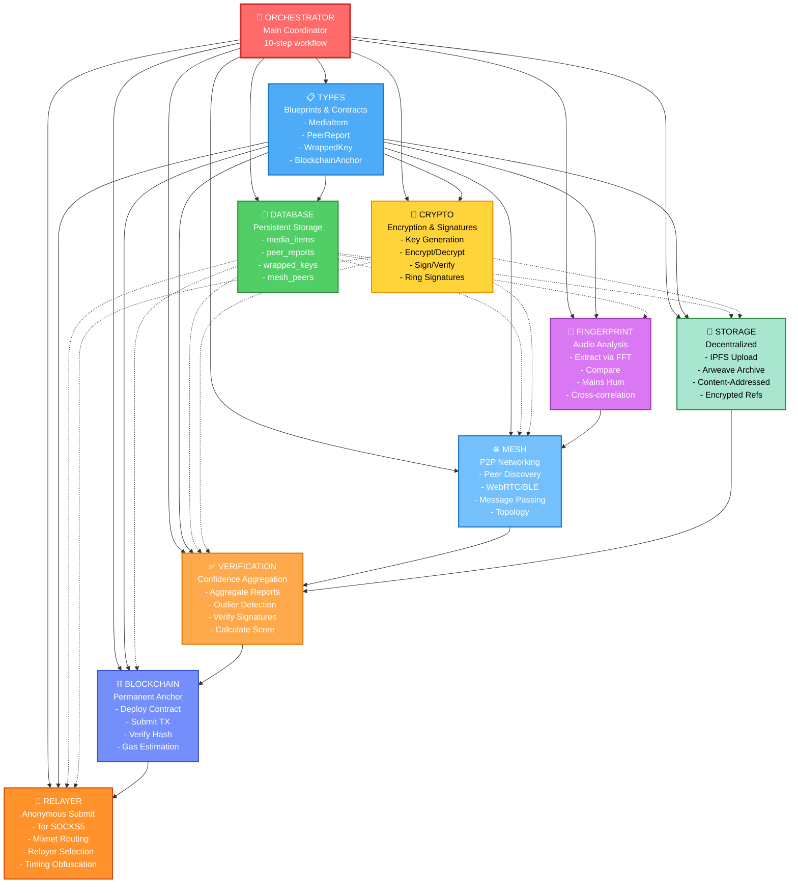
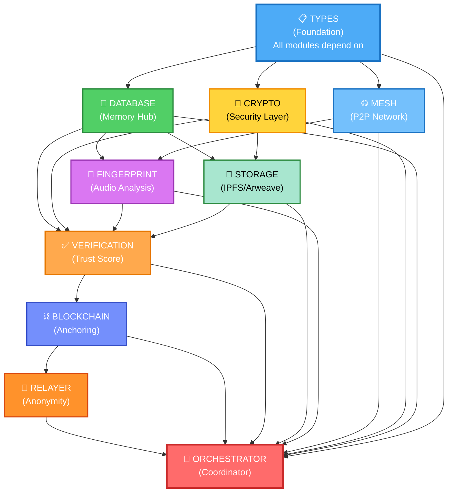
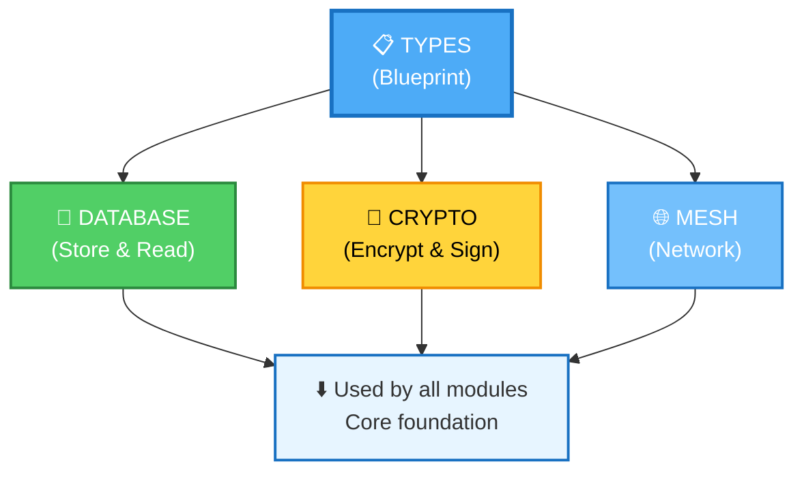
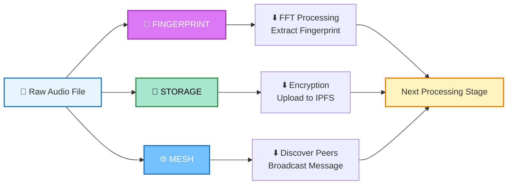
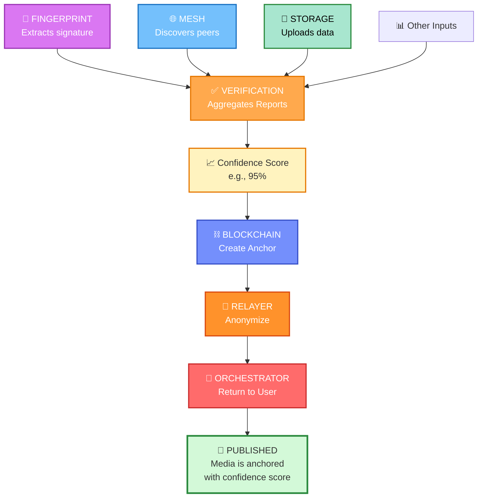

# 🏗️ Framework Architecture Diagram

## System Architecture Overview



---

## Data Flow Diagram

### Publishing Workflow

```mermaid
graph TD
    INPUT["📁 User Input<br/>Audio File"]
    
    STEP1["ORCH Step 1-2<br/>Validate & Extract"]
    STEP2["ORCH Step 3-4<br/>Encrypt & Store"]
    STEP3["ORCH Step 5-6<br/>Discover & Share"]
    STEP4["ORCH Step 7-8<br/>Gather & Verify"]
    STEP5["ORCH Step 9-10<br/>Anchor & Publish"]
    RESULT["🎉 PUBLISHED<br/>Blockchain Anchored<br/>Confidence Score Ready"]
    
    TYPES_CHECK["TYPES<br/>Validate Structure"]
    FINGER_EXTRACT["FINGERPRINT<br/>Extract via FFT"]
    DB1["DATABASE<br/>Store Fingerprint"]
    
    CRYPTO_ENC["CRYPTO<br/>Encrypt Metadata"]
    STORAGE_UP["STORAGE<br/>Upload to IPFS"]
    DB2["DATABASE<br/>Store CID Reference"]
    
    MESH_DISC["MESH<br/>Discover Peers"]
    MESH_SHARE["MESH<br/>Share Fingerprint"]
    DB3["DATABASE<br/>Record Peers"]
    
    MESH_GATHER["MESH<br/>Collect Reports"]
    CRYPTO_VERIFY["CRYPTO<br/>Verify Signatures"]
    VERIF_AGG["VERIFICATION<br/>Aggregate Reports"]
    DB4["DATABASE<br/>Store Confidence"]
    
    RELAY_ANON["RELAYER<br/>Anonymize via Tor"]
    BLOCK_ANCHOR["BLOCKCHAIN<br/>Submit Transaction"]
    DB5["DATABASE<br/>Store TX Hash"]
    CRYPTO_PROOF["CRYPTO<br/>Create Proof"]
    
    INPUT --> STEP1
    
    STEP1 --> TYPES_CHECK
    STEP1 --> FINGER_EXTRACT
    TYPES_CHECK --> FINGER_EXTRACT
    FINGER_EXTRACT --> DB1
    DB1 --> STEP2
    
    STEP2 --> CRYPTO_ENC
    STEP2 --> STORAGE_UP
    CRYPTO_ENC --> STORAGE_UP
    STORAGE_UP --> DB2
    DB2 --> STEP3
    
    STEP3 --> MESH_DISC
    STEP3 --> MESH_SHARE
    MESH_DISC --> MESH_SHARE
    MESH_SHARE --> DB3
    DB3 --> STEP4
    
    STEP4 --> MESH_GATHER
    STEP4 --> CRYPTO_VERIFY
    MESH_GATHER --> CRYPTO_VERIFY
    CRYPTO_VERIFY --> VERIF_AGG
    VERIF_AGG --> DB4
    DB4 --> STEP5
    
    STEP5 --> RELAY_ANON
    STEP5 --> CRYPTO_PROOF
    RELAY_ANON --> BLOCK_ANCHOR
    BLOCK_ANCHOR --> DB5
    DB5 --> RESULT
    CRYPTO_PROOF --> RESULT
    
    style INPUT fill:#e7f5ff,stroke:#1971c2,stroke-width:2px
    style RESULT fill:#d3f9d8,stroke:#2b8a3e,stroke-width:3px
    style STEP1 fill:#fff3bf,stroke:#e67700
    style STEP2 fill:#fff3bf,stroke:#e67700
    style STEP3 fill:#fff3bf,stroke:#e67700
    style STEP4 fill:#fff3bf,stroke:#e67700
    style STEP5 fill:#fff3bf,stroke:#e67700
    style DB1 fill:#c5f6fa,stroke:#0d9488
    style DB2 fill:#c5f6fa,stroke:#0d9488
    style DB3 fill:#c5f6fa,stroke:#0d9488
    style DB4 fill:#c5f6fa,stroke:#0d9488
    style DB5 fill:#c5f6fa,stroke:#0d9488
```



---

## Module Dependency Graph



---

## Module Communication Patterns

### 1️⃣ Core Trio (Foundation)



**Pattern**: Types define structure → Database stores → Crypto secures → Others use all three

---

### 2️⃣ Feature Processors (Data Transformation)



**Pattern**: Each processor transforms data → next processor uses output → orchestrator chains them

---

### 3️⃣ Verification & Anchoring (Convergence)



**Pattern**: Multiple inputs converge → verification aggregates → blockchain anchors → relayer anonymizes

---

## Data Structure Flow

```mermaid
graph LR
    INPUT["📁 INPUT<br/>MediaItem {<br/>  id<br/>  contentHash<br/>  title<br/>}"]
    
    DB1["💾 DATABASE<br/>Stores<br/>MediaItem"]
    
    CRYPTO1["🔐 CRYPTO<br/>Encrypts<br/>metadata"]
    
    STORAGE1["💾 STORAGE<br/>Uploads to<br/>IPFS/Arweave"]
    
    FINGER1["🎵 FINGERPRINT<br/>Extracts<br/>fingerprint"]
    
    DB2["💾 DATABASE<br/>Stores<br/>Fingerprint"]
    
    MESH1["🌐 MESH<br/>Discovers<br/>peers"]
    
    MESH2["🌐 MESH<br/>Broadcasts<br/>fingerprint"]
    
    DB3["💾 DATABASE<br/>Records<br/>peer_connections"]
    
    INPUT --> DB1
    INPUT --> CRYPTO1
    INPUT --> FINGER1
    
    DB1 --> STORAGE1
    CRYPTO1 --> STORAGE1
    FINGER1 --> DB2
    
    DB2 --> MESH1
    DB2 --> MESH2
    MESH1 --> DB3
    MESH2 --> PEERS["🌐 PEER RESPONSES<br/>PeerReport {<br/>  reportingPeerId<br/>  fingerprint<br/>  matches<br/>  signature<br/>  timestamp<br/>}"]
    
    PEERS --> DB4["💾 DATABASE<br/>Stores<br/>PeerReports"]
    
    DB4 --> VERIF["✅ VERIFICATION<br/>Aggregates<br/>reports"]
    
    VERIF --> SCORE["📈 Confidence: 95%"]
    
    SCORE --> ANCHOR["⛓️ BlockchainAnchor {<br/>  contentHash<br/>  confidence<br/>  txHash<br/>  timestamp<br/>}"]
    
    ANCHOR --> BLOCK["⛓️ BLOCKCHAIN<br/>Submits<br/>anchor"]
    
    BLOCK --> RELAY["🔀 RELAYER<br/>Anonymizes<br/>via Tor"]
    
    RELAY --> DONE["🎉 PUBLISHED<br/>Blockchain<br/>Confirmed"]
    
    style INPUT fill:#e7f5ff,stroke:#1971c2,stroke-width:2px
    style DB1 fill:#c5f6fa,stroke:#0d9488,stroke-width:2px
    style DB2 fill:#c5f6fa,stroke:#0d9488,stroke-width:2px
    style DB3 fill:#c5f6fa,stroke:#0d9488,stroke-width:2px
    style DB4 fill:#c5f6fa,stroke:#0d9488,stroke-width:2px
    style CRYPTO1 fill:#ffd43b,stroke:#f08c00,stroke-width:2px,color:#000
    style STORAGE1 fill:#a8e6cf,stroke:#2b8a3e,stroke-width:2px,color:#000
    style FINGER1 fill:#da77f2,stroke:#9c36b5,stroke-width:2px,color:#fff
    style MESH1 fill:#74c0fc,stroke:#1971c2,stroke-width:2px,color:#fff
    style MESH2 fill:#74c0fc,stroke:#1971c2,stroke-width:2px,color:#fff
    style PEERS fill:#e7f5ff,stroke:#1971c2,stroke-width:2px
    style VERIF fill:#ffa94d,stroke:#e67700,stroke-width:2px,color:#fff
    style SCORE fill:#fff3bf,stroke:#e67700,stroke-width:2px
    style ANCHOR fill:#f1e7e7,stroke:#5c5c5c,stroke-width:2px
    style BLOCK fill:#748ffc,stroke:#364fc7,stroke-width:2px,color:#fff
    style RELAY fill:#ff922b,stroke:#d9480f,stroke-width:2px,color:#fff
    style DONE fill:#d3f9d8,stroke:#2b8a3e,stroke-width:3px
```



---

## Integration Points

### Types ↔ All Modules
```
All modules import from types/index.ts:
  - MediaItem (for storing media metadata)
  - PeerReport (for gathering peer feedback)
  - WrappedKey (for encrypted transmission)
  - BlockchainAnchor (for anchoring records)
  - etc.
```

### Database ↔ All Modules
```
All modules read/write to database:
  - FINGERPRINT writes extracted signatures
  - MESH writes peer connections
  - STORAGE writes upload references
  - BLOCKCHAIN writes transaction records
  - VERIFICATION writes confidence scores
```

### Crypto ↔ Feature Modules
```
Encryption layer used by:
  - STORAGE (encrypts before uploading)
  - MESH (encrypts peer messages)
  - VERIFICATION (signs reports)
  - RELAYER (signs submissions)
```

### Mesh ↔ Verification
```
1. MESH discovers peers
2. MESH sends fingerprint to peers
3. Peers respond with PeerReport
4. MESH collects reports
5. VERIFICATION processes reports
6. Confidence score calculated
```

### Verification ↔ Blockchain
```
1. VERIFICATION aggregates peer reports
2. Creates BlockchainAnchor with confidence
3. Sends to BLOCKCHAIN module
4. BLOCKCHAIN creates transaction
5. RELAYER anonymizes and broadcasts
6. Anchored on-chain ✅
```

---

## Execution Order: Publishing Media

```mermaid
graph TD
    S1["1️⃣ User uploads media"]
    S2["2️⃣ TYPES validates structure"]
    S3["3️⃣ FINGERPRINT extracts signature"]
    S4["4️⃣ DATABASE stores fingerprint"]
    S5["5️⃣ CRYPTO encrypts metadata"]
    S6["6️⃣ STORAGE uploads encrypted data"]
    S7["7️⃣ DATABASE stores CID reference"]
    S8["8️⃣ MESH discovers peers"]
    S9["9️⃣ MESH broadcasts fingerprint"]
    S10["🔟 Peers respond with reports"]
    S11["1️⃣1️⃣ MESH collects reports"]
    S12["1️⃣2️⃣ VERIFICATION aggregates"]
    S13["1️⃣3️⃣ VERIFICATION calculates confidence"]
    S14["1️⃣4️⃣ DATABASE stores confidence"]
    S15["1️⃣5️⃣ BLOCKCHAIN creates anchor tx"]
    S16["1️⃣6️⃣ RELAYER anonymizes submission"]
    S17["1️⃣7️⃣ Transaction broadcasted"]
    S18["1️⃣8️⃣ Transaction mined ✅"]
    RESULT["🎉 MEDIA PUBLISHED 🎉<br/>✓ IPFS CID: QmXxxx...<br/>✓ Confidence: 95%<br/>✓ TX Hash: 0xABCD...<br/>✓ Timestamp: Nov 20, 2025"]
    
    S1 --> S2
    S2 --> S3
    S3 --> S4
    S4 --> S5
    S5 --> S6
    S6 --> S7
    S7 --> S8
    S8 --> S9
    S9 --> S10
    S10 --> S11
    S11 --> S12
    S12 --> S13
    S13 --> S14
    S14 --> S15
    S15 --> S16
    S16 --> S17
    S17 --> S18
    S18 --> RESULT
    
    style S1 fill:#e7f5ff,stroke:#1971c2,stroke-width:2px
    style S2 fill:#4dabf7,stroke:#1971c2,stroke-width:2px,color:#fff
    style S3 fill:#da77f2,stroke:#9c36b5,stroke-width:2px,color:#fff
    style S4 fill:#c5f6fa,stroke:#0d9488,stroke-width:2px
    style S5 fill:#ffd43b,stroke:#f08c00,stroke-width:2px,color:#000
    style S6 fill:#a8e6cf,stroke:#2b8a3e,stroke-width:2px,color:#000
    style S7 fill:#c5f6fa,stroke:#0d9488,stroke-width:2px
    style S8 fill:#74c0fc,stroke:#1971c2,stroke-width:2px,color:#fff
    style S9 fill:#74c0fc,stroke:#1971c2,stroke-width:2px,color:#fff
    style S10 fill:#74c0fc,stroke:#1971c2,stroke-width:2px,color:#fff
    style S11 fill:#74c0fc,stroke:#1971c2,stroke-width:2px,color:#fff
    style S12 fill:#ffa94d,stroke:#e67700,stroke-width:2px,color:#fff
    style S13 fill:#ffa94d,stroke:#e67700,stroke-width:2px,color:#fff
    style S14 fill:#c5f6fa,stroke:#0d9488,stroke-width:2px
    style S15 fill:#748ffc,stroke:#364fc7,stroke-width:2px,color:#fff
    style S16 fill:#ff922b,stroke:#d9480f,stroke-width:2px,color:#fff
    style S17 fill:#ff922b,stroke:#d9480f,stroke-width:2px,color:#fff
    style S18 fill:#748ffc,stroke:#364fc7,stroke-width:2px,color:#fff
    style RESULT fill:#d3f9d8,stroke:#2b8a3e,stroke-width:3px
```



---

## Module Complexity & Dependencies

```
COMPLEXITY    MODULE               DEPENDS ON          BUILD ORDER
═════════════════════════════════════════════════════════════════════
⭐ Easy       TYPES               (nothing)            1️⃣ First
⭐ Easy       DATABASE            TYPES                2️⃣ Second  
⭐⭐ Medium   CRYPTO              TYPES, DATABASE      3️⃣ Third
⭐⭐ Medium   STORAGE             TYPES, DATABASE,     4️⃣ Fourth
                                  CRYPTO
⭐⭐ Medium   FINGERPRINT         TYPES, DATABASE      5️⃣ Fifth
⭐⭐ Medium   VERIFICATION        TYPES, DATABASE,     6️⃣ Sixth
                                  CRYPTO
⭐⭐⭐ Hard   MESH                TYPES, DATABASE,     7️⃣ Seventh
                                  CRYPTO
⭐⭐⭐ Hard   BLOCKCHAIN          TYPES, DATABASE,     8️⃣ Eighth
                                  CRYPTO
⭐⭐⭐ Hard   RELAYER             TYPES, DATABASE,     9️⃣ Ninth
                                  CRYPTO
⭐⭐⭐ Hard   ORCHESTRATOR        ALL                   🔟 Last
```

---

## Quick Reference: Who Talks to Whom

| Module | Reads From | Writes To | Talks To |
|--------|-----------|-----------|----------|
| TYPES | - | - | (defines contracts) |
| DATABASE | - | All tables | All modules |
| CRYPTO | TYPES | - | STORAGE, MESH, VERIFICATION, RELAYER |
| STORAGE | TYPES | storage_uploads | CRYPTO, DATABASE, ORCHESTRATOR |
| FINGERPRINT | TYPES, DATABASE | media_items | DATABASE, MESH, ORCHESTRATOR |
| MESH | TYPES, DATABASE | mesh_peers, peer_reports | FINGERPRINT, VERIFICATION, ORCHESTRATOR |
| VERIFICATION | TYPES, DATABASE | peer_reports | BLOCKCHAIN, ORCHESTRATOR |
| BLOCKCHAIN | TYPES, DATABASE | anchor_submissions | RELAYER, ORCHESTRATOR |
| RELAYER | TYPES, DATABASE | relayer_nodes | BLOCKCHAIN, ORCHESTRATOR |
| ORCHESTRATOR | All modules | - | Coordinates all |

---

## 🎯 Key Takeaways

1. **TYPES** is the foundation - all modules depend on it
2. **DATABASE** is the memory - all modules read/write to it
3. **CRYPTO** is the security core - powers confidentiality & authentication
4. **Feature modules** (FINGERPRINT, MESH, STORAGE) process and validate
5. **VERIFICATION** aggregates trust signals
6. **BLOCKCHAIN** creates immutable record
7. **RELAYER** provides anonymity
8. **ORCHESTRATOR** coordinates the entire workflow

Build in this order for success! 🚀
